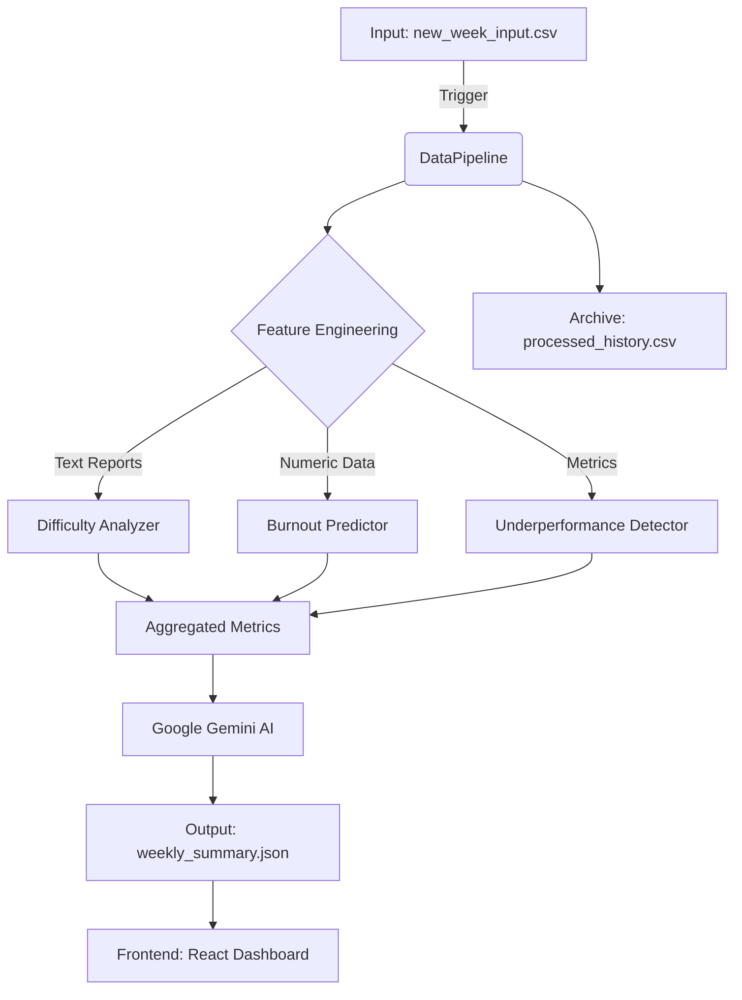

# 🚀 WorkPace Data Pipeline Architecture

This document outlines the architecture of the data processing pipeline and the machine learning models used in the WorkPace dashboard.

## 1. Architecture Overview

The system follows a linear data pipeline that processes weekly employee data, runs predictive models, generates AI insights, and updates the frontend dashboards.

## 2. Machine Learning Models

### A. Difficulty Work Score (Text Classification)
*   **Goal:** Quantify the "difficulty" or "mental fatigue" of an employee based on their weekly text report.
*   **Model Architecture:** **Sentence-BERT + Gradient Boosting**.
    *   **Embedding Layer:** Uses `sentence-transformers/all-MiniLM-L6-v2` to convert text reports into dense 384-dimensional vector embeddings. This captures semantic meaning better than simple keyword matching.
    *   **Classifier:** A **Gradient Boosting Classifier** (sklearn) takes these embeddings and predicts a difficulty score from 0 to 10.
*   **Why this approach?**
    *   Sentence-BERT is highly efficient and effective for semantic similarity.
    *   Gradient Boosting performs excellently on structured embedding data.
    *   *Note:* In the current demo mode (if text reports are missing), the pipeline falls back to a heuristic based on Resource Allocation.

### B. Burnout Risk Prediction
*   **Goal:** Predict the probability (0-1) of an employee burning out.
*   **Model:** **Random Forest Regressor** (or XGBoost).
*   **Features:**
    *   `Designation` (Level)
    *   `Resource Allocation` (Workload)
    *   `Mental Fatigue Score` (Derived from Difficulty Model)
    *   `WFH Setup Available`
    *   `Gender`
*   **Output:** A risk score between 0.0 (Low Risk) and 1.0 (Critical Risk).

### C. Underperformance Detection
*   **Goal:** Identify employees struggling with their workload.
*   **Logic:** Rule-based system analyzing the correlation between `Performance Score` (simulated) and `Resource Allocation`.
    *   **High Workload + Low Performance** = "Overburdened"
    *   **Low Workload + Low Performance** = "Disengaged"

## 3. AI Insights (LLM Integration)
*   **Provider:** Google Gemini Pro (via API).
*   **Process:**
    1.  The pipeline aggregates the top critical and warning cases.
    2.  It constructs a prompt summarizing the team's health.
    3.  Gemini generates an "Executive Summary" with bullet points on:
        *   **Critical Alerts:** Who needs immediate help.
        *   **Trends:** Overall team direction.
        *   **Recommendations:** Specific actions for the manager.

## 4. Data Flow & Archiving
1.  **Ingestion:** User drops `new_week_input.csv` into `backend/data/`.
2.  **Processing:** User clicks "Process Next Week" on the dashboard.
3.  **Archiving:**
    *   The raw input is saved as `archive/week_{N}.csv`.
    *   The processed JSON is saved as `archive/week_{N}.json`.
    *   The main history file `processed_history.csv` is appended.
4.  **Display:** The frontend fetches `weekly_summary.json` to render the latest view.
